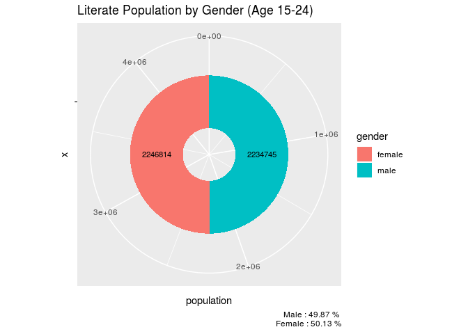
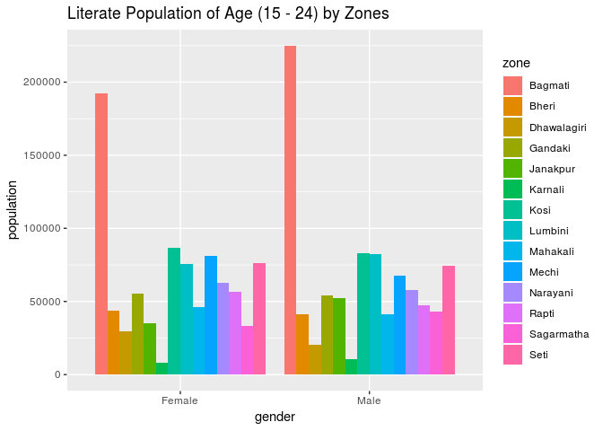

## Summary  

This data set includes literacy rate status by age group 15-24  by literate population and total population for 2013. The data is extracted from Literacy Status Report 2013 submitted to UNESCO Kathmandu .

We use data set from [Open Data Nepal](http://data.opennepal.net/content/literacy-rate-status-age-group-15-24-2013) for visualization.

In this visualization project, we explore the data based on male and female literacy.

## Literate Population by Gender

## Literate Population by Zones

