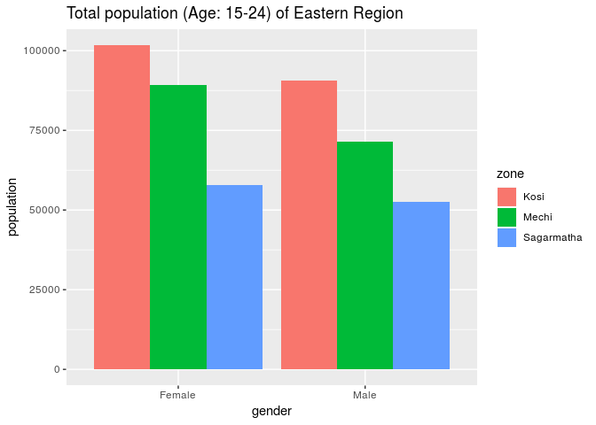

The data set is provided by Open Nepal which contains literacy population of age group (15-24) based on zone, region, districts.

# Import the data file


```r
literacy <- read.csv("./data/literacy-rate.csv", stringsAsFactors = FALSE)

head(literacy)
```

```
##    District  Zone Geographical.Region Development.Region
## 1 Taplejung Mechi            Mountain            Eastern
## 2 Taplejung Mechi            Mountain            Eastern
## 3 Taplejung Mechi            Mountain            Eastern
## 4 Taplejung Mechi            Mountain            Eastern
## 5 Panchthar Mechi                Hill            Eastern
## 6 Panchthar Mechi                Hill            Eastern
##                             Sub.Group Male..Female Value
## 1 Literate Population by age 15 - 24         Male  11483
## 2 Literate Population by age 15 - 24       Female  13133
## 3    Total Population by age 15 - 24         Male  12116
## 4    Total Population by age 15 - 24       Female  14176
## 5 Literate Population by age 15 - 24         Male  17228
## 6 Literate Population by age 15 - 24       Female  21424
```


# Rename the column headers


```r
names(literacy) <- c("district", "zone", "geo_region", "dev_region", "group", "gender", "population")

head(literacy)
```

```
##    district  zone geo_region dev_region
## 1 Taplejung Mechi   Mountain    Eastern
## 2 Taplejung Mechi   Mountain    Eastern
## 3 Taplejung Mechi   Mountain    Eastern
## 4 Taplejung Mechi   Mountain    Eastern
## 5 Panchthar Mechi       Hill    Eastern
## 6 Panchthar Mechi       Hill    Eastern
##                                 group  gender population
## 1 Literate Population by age 15 - 24    Male       11483
## 2 Literate Population by age 15 - 24  Female       13133
## 3    Total Population by age 15 - 24    Male       12116
## 4    Total Population by age 15 - 24  Female       14176
## 5 Literate Population by age 15 - 24    Male       17228
## 6 Literate Population by age 15 - 24  Female       21424
```


# Rename the population sub-groups


```r
# get number of rows
nrow(literacy)
```

```
## [1] 300
```

```r
# renaming is needed for any long names
pop <- lapply(literacy$group, function(x) if(x == "Literate Population by age 15 - 24 "){ x = "literate_pop"} else{ x = "total_pop" } )
literacy$group <- sapply(pop, paste0, collapse="") 

# cleaning gender column

library(stringr)
library(dplyr)

replace_sp <- "[[:space:]].*"

literacy <- literacy %>% 
  mutate(gender = str_replace_all(gender, replace_sp, "")) 
```

# Get the literate population


```r
literacy_pop <- literacy %>% 
  filter(group == "literate_pop")
```


```r
library(ggplot2)

ggplot(literacy_pop, aes(x = gender, y = population)) +
  geom_bar(stat = "identity", aes(fill = zone), position = "dodge") +
  ggtitle("Literate Population of Age (15 - 24) by Zones")
```

<!-- -->


# Literate population by gender


```r
get_population <- literacy %>% 
  filter(group == "total_pop")

head(get_population)
```

```
##    district  zone geo_region dev_region     group gender population
## 1 Taplejung Mechi   Mountain    Eastern total_pop   Male      12116
## 2 Taplejung Mechi   Mountain    Eastern total_pop Female      14176
## 3 Panchthar Mechi       Hill    Eastern total_pop   Male      17877
## 4 Panchthar Mechi       Hill    Eastern total_pop Female      22519
## 5      Ilam Mechi       Hill    Eastern total_pop   Male      28524
## 6      Ilam Mechi       Hill    Eastern total_pop Female      33183
```


```r
total_male <- get_population %>% 
  filter(gender == "Male")

total_male_pop <- sum(total_male$population)

total_male_pop
```

```
## [1] 2487172
```

```r
total_female <- get_population %>% 
  filter(gender == "Female")

total_female_pop <- sum(total_female$population)
total_female_pop
```

```
## [1] 2802879
```

# Total population of age group 15-24


```r
total_population <- total_male_pop + total_female_pop
total_population
```

```
## [1] 5290051
```

# Total literate population


```r
head(literacy_pop)
```

```
##    district  zone geo_region dev_region        group gender population
## 1 Taplejung Mechi   Mountain    Eastern literate_pop   Male      11483
## 2 Taplejung Mechi   Mountain    Eastern literate_pop Female      13133
## 3 Panchthar Mechi       Hill    Eastern literate_pop   Male      17228
## 4 Panchthar Mechi       Hill    Eastern literate_pop Female      21424
## 5      Ilam Mechi       Hill    Eastern literate_pop   Male      27645
## 6      Ilam Mechi       Hill    Eastern literate_pop Female      32077
```

```r
literate_male <- literacy_pop %>% 
  filter(gender == "Male")

head(literate_male)
```

```
##    district  zone geo_region dev_region        group gender population
## 1 Taplejung Mechi   Mountain    Eastern literate_pop   Male      11483
## 2 Panchthar Mechi       Hill    Eastern literate_pop   Male      17228
## 3      Ilam Mechi       Hill    Eastern literate_pop   Male      27645
## 4     Jhapa Mechi      Terai    Eastern literate_pop   Male      67750
## 5    Morang  Kosi      Terai    Eastern literate_pop   Male      83084
## 6   Sunsari  Kosi      Terai    Eastern literate_pop   Male      66394
```

```r
total_literate_male <- sum(literate_male$population)
total_literate_male
```

```
## [1] 2234745
```


```r
literate_female <- literacy_pop %>% 
  filter(gender == "Female")

total_literate_female <- sum(literate_female$population)
total_literate_female
```

```
## [1] 2246814
```

# Total literate population of age group (15-24)


```r
total_literate_population <- total_literate_male + total_literate_female
total_literate_population
```

```
## [1] 4481559
```

# Total illiterate population of age group (15-24)


```r
illiterate_population <- total_population - total_literate_population
illiterate_population
```

```
## [1] 808492
```

# Creating a dataframe


```r
population_summary <- data.frame(
  c("literate_pop", "literate_pop", "total_pop", "total_pop"),
  c("male", "female", "male", "female"), 
  c(2234745, 2246814, 2487172, 2802879), stringsAsFactors = FALSE)

names(population_summary) <- c("group", "gender", "population")

head(population_summary)
```

```
##          group gender population
## 1 literate_pop   male    2234745
## 2 literate_pop female    2246814
## 3    total_pop   male    2487172
## 4    total_pop female    2802879
```


```r
literate_gender <- population_summary %>% 
  filter(group == "literate_pop")

literate_gender$percent[1] <- literate_gender$population[1] / sum(literate_gender$population) * 100
literate_gender$percent[2] <-  literate_gender$population[2] / sum(literate_gender$population) * 100

ggplot(literate_gender, aes(x = "", y = population, fill = gender)) +
  geom_bar(stat = "identity", width = 0.5) +
  coord_polar("y", start=0) +
  labs(title="Literate Population by Gender (Age 15-24)", caption= "Female : 49.87 % \n Male : 50.13 %") +
  geom_text(aes(label = population), position = position_stack(vjust = 0.5), size = 3) 
```

<!-- -->


```r
eastern_region <- literacy %>% 
  filter(dev_region == "Eastern")

literate_east <- eastern_region %>% 
  filter(group == "literate_pop")

total_east <- eastern_region %>% 
  filter(group == "total_pop")
```


```r
ggplot(literate_east, aes(x = gender, y = population)) +
  geom_bar(stat = "identity", aes(fill = zone), position = "dodge") +
  ggtitle("Literacy population (Age: 15-24) of Eastern Region")
```

<!-- -->

```r
ggplot(total_east, aes(x = gender, y = population)) +
  geom_bar(stat = "identity", aes(fill = zone), position = "dodge") +
  ggtitle("Total population (Age: 15-24) of Eastern Region")
```

<!-- -->


```r
literacy_sagarmatha <- literate_east %>% 
  filter(zone == "Sagarmatha")

total_sagarmatha <- total_east %>% 
  filter(zone == "Sagarmatha")
```


```r
ggplot(literacy_sagarmatha, aes(x = district, y = population)) +
  geom_bar(stat = "identity", aes(fill = gender), position = "dodge") +
  ggtitle("Literate population of Sagarmatha zone (Age 15-24)")
```

<!-- -->

```r
ggplot(total_sagarmatha, aes(x = district, y = population)) +
  geom_bar(stat = "identity", aes(fill = gender), position = "dodge") +
  ggtitle("Total population of Sagarmatha zone (Age 15-24)")
```

<!-- -->

